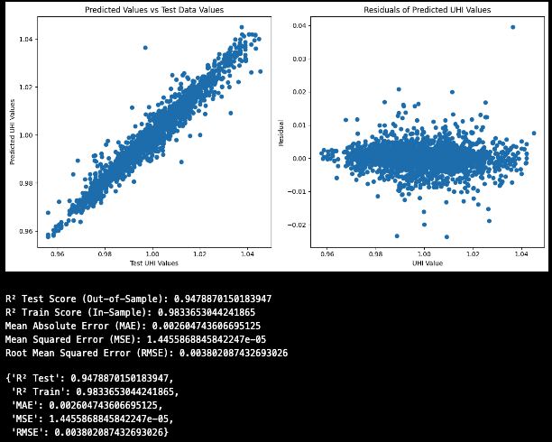
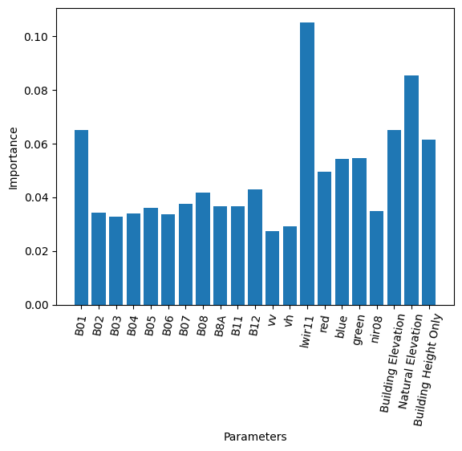
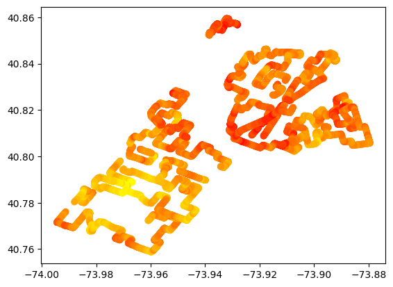
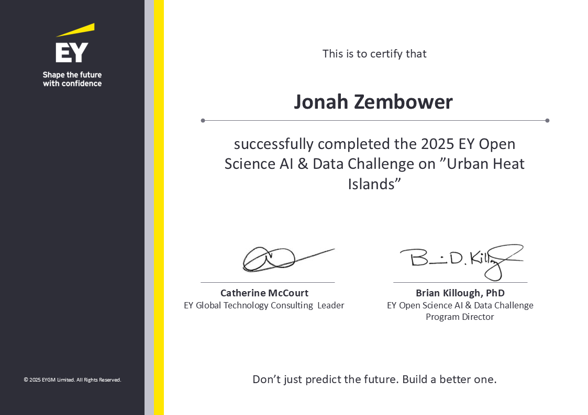

# Urban Heat Island Prediction with Machine Learning

## Overview

This GitHub Repo contains Jonah Zembower and Benjamin Nicholson's work from the EY Data Challenge 2025: Predicting Urban Heat Islands. 
We built a predictive machine learning model to identify Urban Heat Islands (UHI) using remote sensing and iterative Machine Learning pipelines.
Over the source of the project we leveraged a variety of satellite imagery, geospatial data, and machine learning models to accurately predict UHI values.
You can find the final model documentation in the [Model folder](Model/Final_Model.ipynb) as `Final_Model.ipynb` (detailed process of analysis) or `nyc_notebook` (focused specifically on the model).

Our model achieved a final accuracy of 0.9606, ranking 86th globally out of over two thousand participants. 

## Data Sources
1. Sentinel-2 (Multispectral Imaging) median mosaic from 06/01/2021 - 09/01/2021
2. Sentinel-1 (Radar Imaging) median mosaic from 06/01/2021 - 09/01/2021
3. Landsat-8 (Thermal) temperature data from 15th May 2021
4. Landsat-8 (Non Thermal) median mosaic from 06/01/2021 - 09/01/2021
5. Building & Natural Elevation (NYC Open Data Source)

## Notebook Structure
1. Introduction
2. Load in EY Dataset
3. Satellite Imagery Creation using Microsoft Planetary Computer
4. Load NYC Open Data
5. Load Satellite Data
6. Build Random Forest Model
7. Fit Hyperparameters to Optimize Accuracy
8. Output Final Results

## Results
### Best Model Evaluation
The best model was a Random Forest:
- Max Depth: 37
- Max Features: log2
- Min Samples Leaf: 1
- Min Samples Split: 2
- Number Estimators: 500

  

### Feature Importance
The feature importance of our model is included below. 

### UHI Prediction Heatmap
The below is the heatmap that we have created from our model with a 96.06% accuracy

## Achievements
- Ranked 86th globally with an accuracy of 0.9606.
- Presented findings at Seton Hill University Research Conference.
- Entered in Seton Hill Pitch Competition.

## Reflections
This project presented the power of big data and machine learning and its applications in climate science. 
This has opened the world of data science in climate tech and I look forward to continue contributing to its widespanning impacts.

## Contributors
- Benjamin Nicholson
- Jonah Zembower

